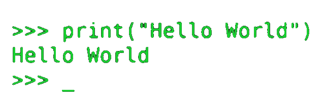

 

Hey there, I am Yashraj, 17. Student at Kendriya Vidyalaya CRPF, Bangalore. A Certified Data Science Expert 😁. 
My passion is to code and my goal is to improve myself [1% better everyday](https://github.com/yashraj2003e/yashraj2003e/blob/main/assets/1%25-better.png). Keeping the maths aside, I love to solve problems. Currently, I am learning [Tensorflow library](https://www.tensorflow.org/).

  
  - <h4>😄 An Alumni of Zero-To-Mastery Academy</h4>
  

  - <h4>🥳 Contributed to Hacktoberfest - 2021</h4>
  

<h2> Github Stats 😉 </h2>

