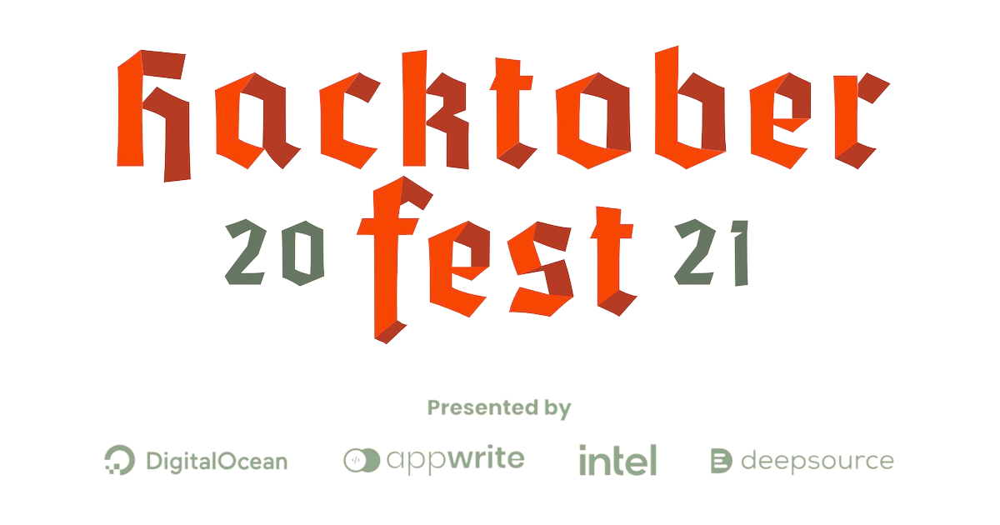

<h1 align="center">print("Hello World !")</h1>
<h3 align="center">Data Science Expert, Artifical Intelligence & IoT enthusiast</h3>
 

Hey there, I am Yashraj, 17. Student at Kendriya Vidyalaya CRPF, Bangalore. My passion is to code and my goal is to improve myself [1% better everyday](https://github.com/yashraj2003e/yashraj2003e/blob/main/assets/1%25-better.png). Keeping the maths aside, I love to solve problems. Currently, I am working on Machine Learning projects.

- 😄 An Alumni of Zero-To-Mastery Academy

- 🥳 Contributed to Hacktoberfest - 2021

<!--

-->

---

<h2> My Github Stats 😉 </h2>

